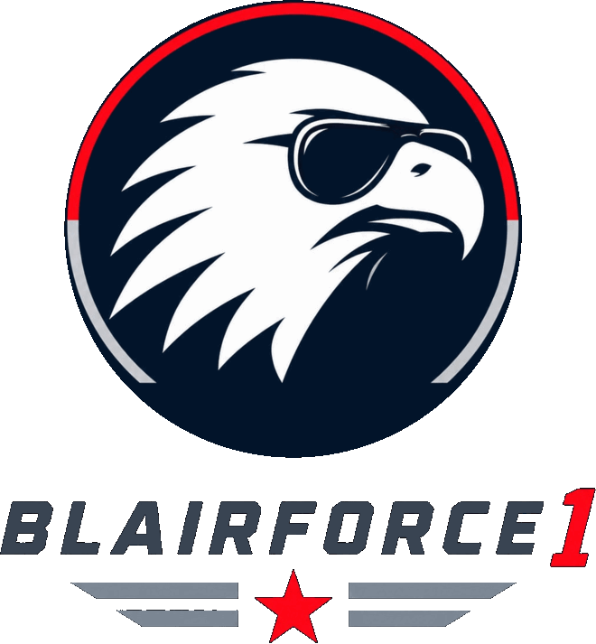

  <picture>
    <source media="(prefers-color-scheme: dark)" srcset="assets/blairforce1-dark.png">
    
  </picture>

<h3 align="center">Platform engineering, GitOps, and agentic delivery</h3>

---

I build the boring infrastructure that lets interesting things ship safely: declarative
environments, deterministic pipelines, and AI agents that operate inside guardrails rather
than around them.

Most of my time goes on three things:

- **GitOps done properly** — Kubernetes, Flux, Kustomize, and the golden paths that make
  "just merge it" a reasonable deployment strategy.
- **.NET platforms** — APIs, templates, and the scaffolding that keeps a fleet of services
  looking like one codebase instead of twenty.
- **Agentic engineering** — Claude Code plugins, review skills, decision records, and
  governance for teams handing real work to autonomous agents.

Opinionated about architecture decision records, automated formatters, and anything that
turns a code review argument into a passing check.

**Toolbox:** .NET · C# · Kubernetes · Flux · Kustomize · Azure · Terraform · Go · Nix · Claude Code

**Reach me:** [git@blairforce1.com](mailto:git@blairforce1.com)
